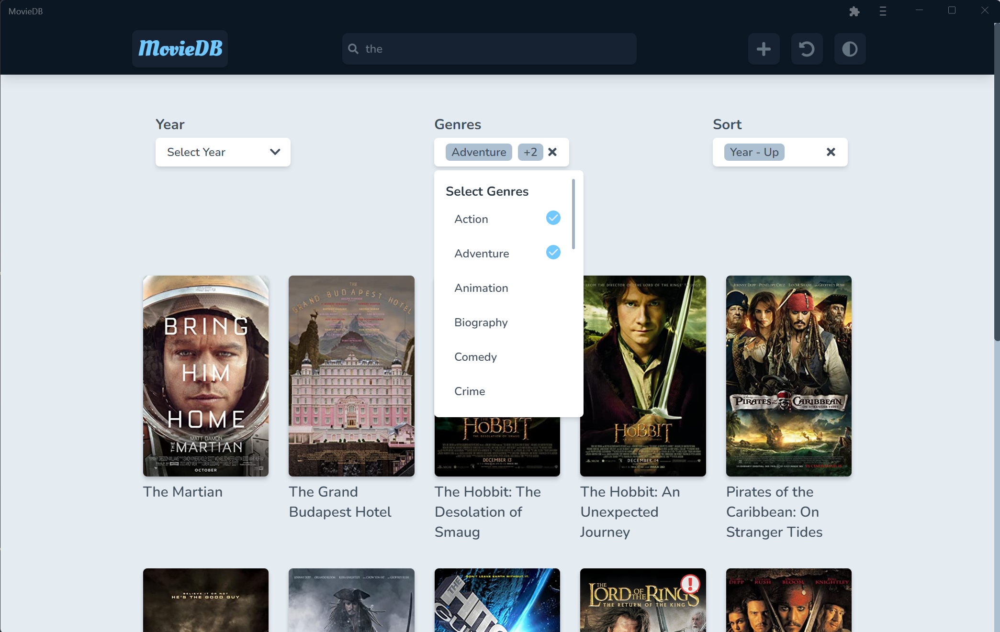
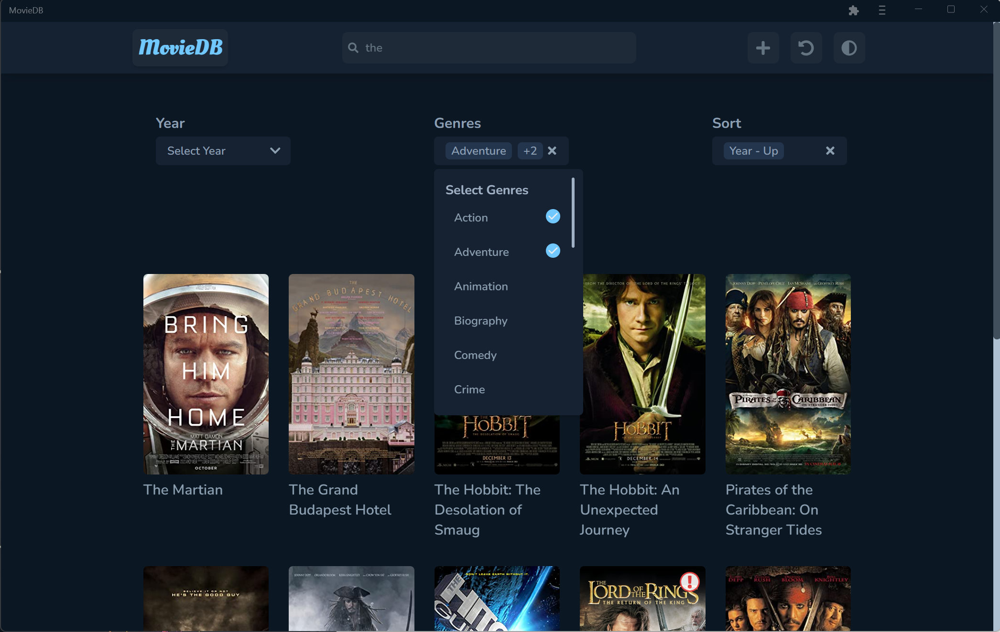
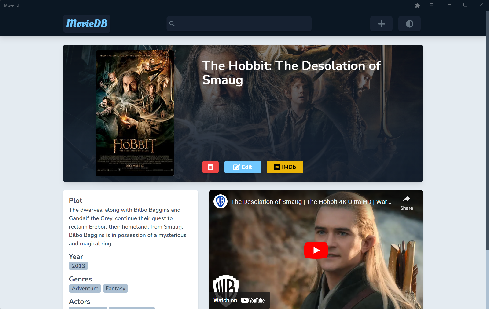
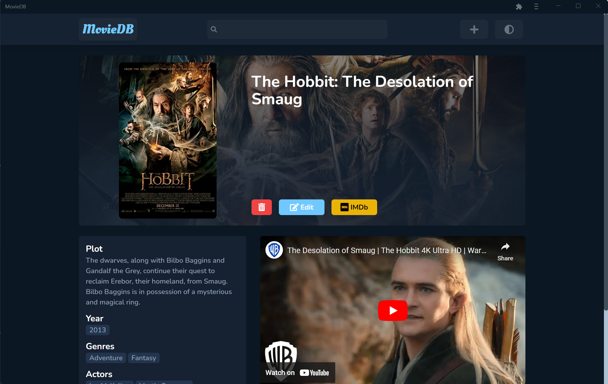
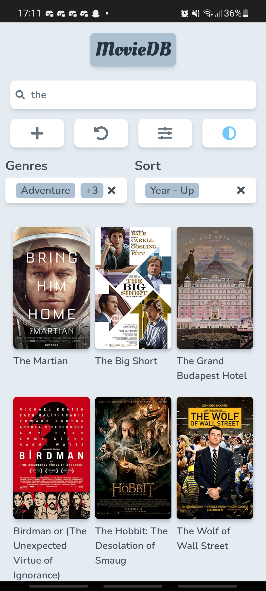
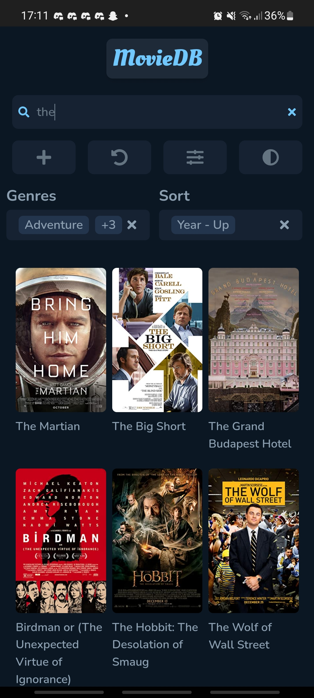
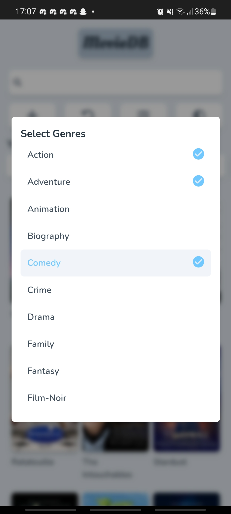
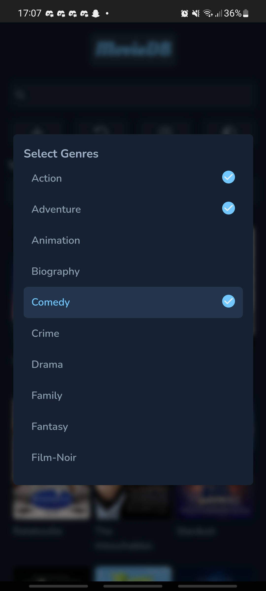
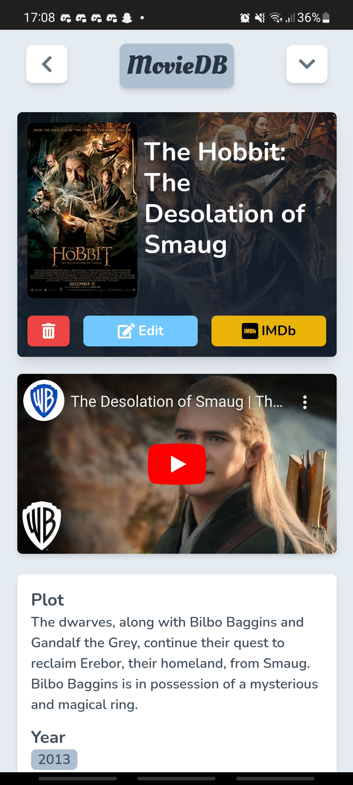
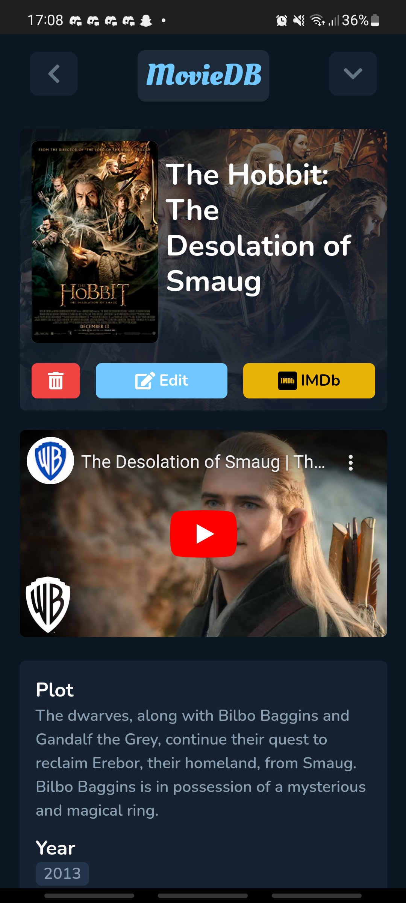

# MERN Stack Movie Project

> Demo at <a href="https://movie-db.up.railway.app" target="_blank">https://movie-db.up.railway.app</a>

A full-stack application built using:

-  TypeScript
-  Node.js
-  React
-  Express.js
-  MongoDB

---

### Screenshots

> UI design heavily inspired by <a href="https://anilist.co/search/anime" target="_blank">https://anilist.co/search/anime</a>












---

### Project Spec

-  Build REST API using Node.js+Express.js
-  Build front-end with React
-  Ability to add/edit/delete movies from front-end.
-  Reset database with data from `https://raw.githubusercontent.com/erik-sytnyk/movies-list/master/db.json`
-  Responsive UI with light and dark theme

---

### Additional Features

-  Fuzzy search, sort, filter (using `URLQueryParams`)
-  Client-side data caching
-  Dynamic import/code splitting for smaller bundle size
-  Installable as PWA
-  Custom selection component (not yet keyboard accessible)
-  Loading skeleton for images, text and iframes
-  Fallback image for broken poster links
-  Extra info (i.e. Banner, YouTube trailer, IMDb link)

---

### Quick Start

##### Requirements

-  Node.js (minimum v14.19.0)
-  MongoDB Atlas (required for `search` aggregation)
-  TheMovieDB API key (<a href="https://developers.themoviedb.org/3/getting-started/introduction" target="_blank">More Info</a>)

##### Optional/Recommended Tools

-  <a href="https://pnpm.io/">pnpm</a>

##### Setup

1. **Create <a href="https://www.mongodb.com/atlas/database" target="_blank">MongoDB Atlas</a> Account**
   <br />
   After account is made...

   -  Create a `New Project`
   -  Create a new Database Cluster in that project
   -  Add a new Collection called `movies` to database
   -  Create a Search Index using index definition (See [mongo-index-def.json](https://github.com/KevinSilvester/mern-movie/blob/main/mongo-index-def.json))

2. **Install Dependencies**

   ```sh
   # server-side dependenices
   pnpm install --frozen-lockfile

   # client-side dependenices
   pnpm install --frozen-lockfile --dir client
   ```

3. **Make a `.env` file in project root**<br />

   > Example: [.env.example](https://github.com/KevinSilvester/mern-movie/blob/main/.env.example)

   ```sh
   # URI to MongoDB Atlas database
   MONGO_URI=mongodb+srv://<USERNAME>:<PASSWORD>@<PROJECT_NAME>.???.???.???

   # Database name
   # Also used as Search index name
   MONGO_DBNAME=database-name

   # TheMovieDB API key
   MOVIEDB_API_KEY=abcdefghijklmnopqrstuvwxyz
   ```

4. **Start dev servers**

   ```sh
   # to start client and server simultaneously
   pnpm dev

   # start client
   pnpm dev:client

   # start server
   pnpm dev:server
   ```

### Key Dependencies/Packages

-  ##### Common

   |                 <!-- -->                 | <!-- -->                            |
   | :--------------------------------------: | :---------------------------------- |
   | [TypeScript](https://typescriptlang.org) | Type safe code                      |
   |         [Zod](https://zod.dev/)          | Schema based validation             |
   |     [Axios](https://axios-http.com)      | HTTP client for browser and node.js |
   |     [Prettier](https://prettier.io)      | Code formatter                      |
   |       [Eslint](https://eslint.org)       | Code Linting                        |

-  ##### Server-Side

   |              <!-- -->               | <!-- -->                               |
   | :---------------------------------: | :------------------------------------- |
   | [Express.js](https://expressjs.com) | Back-end and web application framework |
   | [Mongoosse](https://mongoosejs.org) | MongoDB object modeling tool           |
   |    [Pino](https://getpino.io/#/)    | Console logger                         |

-  ##### Client-Side

   |                                <!-- -->                                 | <!-- -->                                        |
   | :---------------------------------------------------------------------: | :---------------------------------------------- |
   |                      [ViteJs](https://vitejs.dev/)                      | A rapid development tool                        |
   |                      [React](https://reactjs.org/)                      | Front-end JavaScript library                    |
   |             [React-Router](https://reactrouter.com/en/main)             | Client-side routing with React                  |
   |                [Zustand](https://zustand-demo.pmnd.rs/)                 | A bear-bone state-management tool               |
   |              [React Query](https://tanstack.com/query/v4)               | Caching, managing and syncing asynchronous data |
   |             [Framer Motion](https://www.framer.com/motion/)             | For smooth animated transitions/interactions    |
   |                   [Popper.js](https://popper.js.org)                    | Popover positioning engine                      |
   |             [React-Hook-Form](https://react-hook-form.com/)             | Performant form validation                      |
   | [React-Toastify](https://fkhadra.github.io/react-toastify/introduction) | Toast notification in React                     |
   |                 [Filepond](https://pqina.nl/filepond/)                  | JavaScript file upload library                  |
